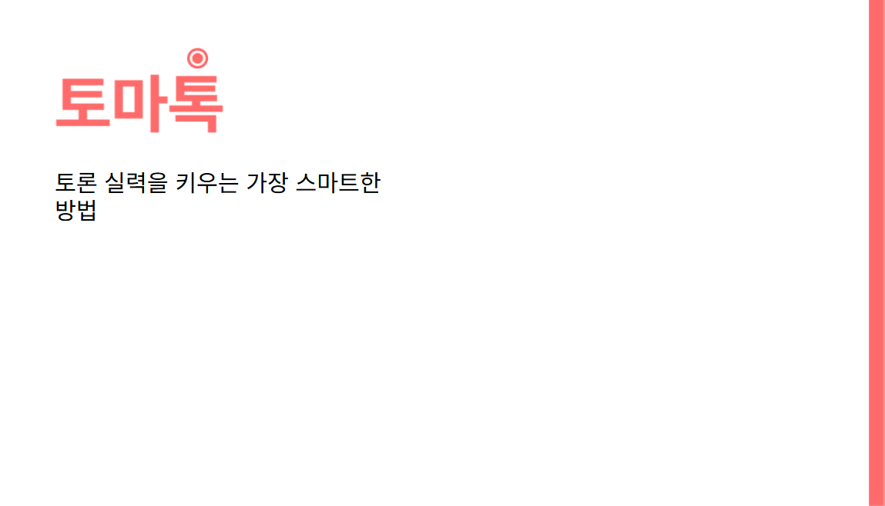

# 토마톡
AI 기반 토론 교육 플랫폼, 토마톡 
- 기간: 2025년 1월 6일 → 2025년 2월 21일 
- 기술 스택: FastAPI, KoBERT, MySQL, OpenVidu, Spring Boot, TypeScript, Vue.js, tailwind, webSocket 
- 개발 인원(역할): 6명(FE, BE)

<aside>

사용자의 논리적 사고력과 토론 능력을 효과적으로 향상 시키는 AI 기반 토론 학습 플랫폼 **"토마톡"**

</aside>

최근 교육 현장에서는 자신의 의견을 표현하고 타인의 의견을 듣는 '토론 능력'이 중요한 핵심 역량으로 부각되고 있습니다. **토마톡**은 이러한 흐름에 맞춰, **학생들이 체계적으로 토론 실력을 키울 수 있도록 설계된 웹 기반 토론 학습 플랫폼**입니다.

토마톡은 사용자가 직접 말로 자신의 주장을 표현하고, AI의 분석과 피드백을 통해 논리성과 표현력을 점검하며 성장할 수 있도록 지원합니다. PREP 기법을 바탕으로 한 **기초 연습**, AI 토론봇과의 **실전 연습**, 실제 사용자와 매칭되어 진행하는 **실전 토론**까지 단계별 커리큘럼으로 구성되어 있어 누구나 쉽고 효과적으로 토론을 배울 수 있습니다.

## **📍** 주요 기능

- **토론 기초 연습**
    1. PREP 기법 기반으로 주장, 근거, 예시, 재주장의 구조를 학습
    2. 예시 문장을 참고해 자신의 의견을 말로 표현하며 논리 구성 연습
    3. 반복 훈련을 통해 주장하는 방식의 패턴과 사고 흐름을 자연스럽게 습득
- **AI 실전 연습**
    1. AI 토론봇과의 1:1 문답을 통해 실전 대비 훈련
    2. 질문 단계를 따라가며 점차 깊이 있는 사고 유도
    3. 소크라테스식 문답 기법을 활용해 주장의 맥락성과 논리성 향상
- **실전 토론 매칭**
    1. 사용자가 선택한 주제와 방식에 따라 실시간 토론 상대 자동 매칭
    2. 토론 중간 참고할 수 있는 메모 기능 제공 (자료 조사 후 저장 가능)
    3. 찬반 양측으로 나뉘어 구조화된 토론을 경험하며 협력적 사고 훈련
- **AI 피드백 및 리포트**
    1. 발화 내용을 AI가 분석하여 욕설, 논리 구조, 말의 흐름 등을 진단
    2. BERT 기반 욕설 탐지 모델과 분석 템플릿을 활용해 종합 피드백 제공
    3. 사용자는 레포트를 통해 자신의 발화 습관 및 개선점을 확인 가능
- **토론 방청 및 분석**
    1. 타인의 토론을 실시간 방청하며 각 발언 내용을 타임라인으로 요약 확인
    2. 논리 분석 템플릿을 제공해 방청하면서 구조 분석 및 필기 가능
    3. 다른 사용자의 토론 방식 학습을 통해 간접 경험 및 자기 성찰 유도

## **🏋️‍♂️ 담당 역할 (AI, FE, BE)**

- Vue + TypeScript + Tailwind 기반 프론트엔드 개발 전반 담당
- 욕설 탐지 LLM fine-tunning(ko-bert) 및 AI 파이프라인 구축

## **🛠️ 기술 스택**

| **분야** | **기술 스택** |
| --- | --- |
| FE | Vue.js, TypeScript |
| BE | Spring Boot, FastAPI |
| AI | koBERT, TTS(edge_tts), STT(whisper) |
| DB | MySQL |
| Tools | JIRA, confluence, git, figma, webRTC, webSocket, OpenVidu |

## **🛠️ 기술 선정 이유**

- **Vue.js**
    
    빠른 개발, 컴포넌트 단위 설계, 대규모 상태 관리 및 SPA 구조에 최적화되어 있어 선정했습니다.
    
    `Vue Router`, `Pinia`, `watch`, `computed` 등 내장 기능을 활용해, 실시간 발화 감지, 토론 진행 상태 변화 등을 효율적으로 제어할 수 있었습니다.
    
- **TypeScript**
    
    대규모 컴포넌트 관리, 협업 및 안정성 강화를 위해 필수적으로 적용했습니다.
    
- **Tailwind CSS**
    
    디자인 시스템을 빠르게 구축하고, 반응형/커스텀 스타일링을 쉽게 적용하고 팀원과 통일할 수 있어 선택했습니다.
    
- **OpenVidu**
    
    WebRTC 기반의 실시간 커뮤니케이션 기능을 빠르게 구축할 수 있어, 토론 플랫폼의 핵심 기능인 화상 연결 및 음성 발화 처리에 적합하여 적용 했습니다.
    
- **koBERT**
    
    발화 내용 중 욕설 및 부적절한 표현을 정확히 탐지하기 위해, 한국어에 특화된 사전 학습 언어 모델인 koBERT를 사용했습니다.
    

## **✨ 구현 사항**

**Front-End**

- **전체 디자인 및 프론트엔드 초기 세팅**
    - 초기 프로젝트 세팅 및 전반적인 디자인 시스템 구성
    - 공통 컴포넌트 재사용성과 유지보수를 고려하여 페이지 구조 설계
    - 사용자의 토론 흐름을 고려한 직관적인 UI 및 애니메이션 구성
- **토론 준비 페이지 구현**
    - 토론 시작 전 사용자가 주제에 대한 자료를 조사할 수 있도록 메모의 입력 및 파일 업로드 기능 구현
    - 작성한 메모는 `localStorage` 에 저장하여 **토론 진행 중에도 불러올 수 있도록** 처리
    - 제한 시간이 끝나면 자동으로 토론 진행 페이지로 `router.push` 되도록 설정
- **토론 진행 페이지 구현**
    - 백엔드와 WebSocket을 통해 토론 진행 상태 수신 → **단계에 따라 UI 동적으로 변경**
    - 현재 토론 단계에 따라 **발언자 표시, 진행 상황 프로그레스 바, 카메라 UI 전환** 처리
    - 발언 중에는 OpenVidu로 WebRTC 스트리밍을 송출하며, **실시간 STT 분석을 위한 연동** 수행
    - 사용자 입장 시, **참여자/방청객 여부를 판단**하여 OpenVidu 세션에 다르게 연결되도록 구현

**AI + Back-End**

- **AI 토론 참여자 발언 생성 기능 구현**
    - 연습 모드 또는 인원 부족 시 AI가 자동으로 토론에 참여할 수 있도록 기능 설계
    - 클라이언트로부터 역할(`role`)과 토론 ID를 전달받아, 해당 토론의 **이전 발언 요약**을 바탕으로 GPT-4o(OpenAI API)를 호출하여 AI 발언 생성
    - 생성된 발언을 DB에 저장하고, 요약 함수 재사용하여 요약 텍스트 추가 저장
    - `edge-tts` 라이브러리를 활용해 생성된 텍스트를 음성 데이터로 변환 후 반환
- **욕설 예측 모델 개발 및 연동**
    - Smilegate 공개 한국어 욕설 데이터셋을 사용해 `beomi/kcbert-base` 기반 다중 라벨 분류 모델 학습
    - `AutoTokenizer`, HuggingFace `transformers` 라이브러리를 활용해 전처리 및 학습 진행
    - 총 5 epoch 학습 진행, Lrap 기준 0.87 ~ 0.88의 성능 확보
    - 학습된 모델을 HuggingFace에 업로드 후, 서버 실행 시 최초 1회 다운로드하여 캐싱하도록 구성
    - 실시간 검사 방식은 부하를 고려해 제외하고, 토론 종료 후 전체 발언에 대한 정적 분석 방식으로 변경하여 피드백 리포트에 활용

## **💫 Trouble Shooting**

- **WebRTC 스트림이 전체 화면을 계속 재렌더링하는 문제**
    - **[문제점]** 토론 중 `OpenVidu`를 통해 WebRTC 세션을 구성할 때, 사용자 본인의 스트림까지 `streamCreated` 이벤트에 의해 `subscribers` 배열에 중복 추가되면서 전체 레이아웃이 반복적으로 재렌더링되는 현상이 발생했습니다. 이로 인해 비디오 타일이 깜빡이거나 잘못된 위치로 렌더링되는 문제가 있었고, 발화 타이머도 리셋되는 현상이 있었습니다.
    - **[해결]** `streamCreated` 이벤트 핸들러 내부에서, 본인 스트림인 경우에는 **`subscribers`**에 추가하지 않도록 예외 처리를 추가했습니다. 이를 통해 화면 깜빡임 없이 안정적인 렌더링이 가능해졌고, 타이머와 발언 순서 관련 UI도 정상적으로 유지되도록 개선되었습니다.
- **BERT 모델 파일 용량 초과로 인한 GitLab 업로드 실패**
    - **[문제점]** 욕설 감지에 사용한 `koBERT` 모델 파일이 수백 MB에 달해 GitLab의 파일 용량 제한을 초과하여 버전 관리가 불가능했고, CI/CD 과정에서도 오류가 발생했습니다. Git LFS 등의 대안도 검토했으나, 팀 협업 및 배포 환경에서 관리가 복잡해질 우려가 있었습니다.
    - **[해결]** Hugging Face Hub에 학습된 모델을 업로드한 뒤, 서버 실행 시 최초 1회만 모델을 다운로드하여 로컬에 캐싱하는 방식으로 전환했습니다. 이를 통해 저장소 용량 문제를 해결하고, 서버 구동 속도와 모델 관리 편의성도 향상시킬 수 있었습니다.
- **OpenVidu 방청객/참여자 권한 처리 문제**
    - **[문제점]** OpenVidu 세션에 사용자가 입장할 때, 방청객과 토론 참여자를 구분하지 않고 동일한 방식으로 세션에 연결되면서 화면 충돌 및 발언 권한 관련 오류가 발생했습니다. 특히, 발언을 하지 않아야 하는 방청객도 스트리밍을 시도하면서 불필요한 자원 낭비 및 UI 혼란이 생겼습니다.
    - **[해결]** 사용자 입장 시 전달되는 `role` 값을 기준으로, 참여자인 경우에만 OpenVidu 세션에 연결되도록 조건 분기하였습니다. 방청객은 토론 스트림만 수신하고, UI는 수동 조작 없이 자동으로 시청 모드로 전환되도록 설정하여 세션 충돌 없이 안정적인 접속이 가능해졌습니다.
- **프로젝트 주제 확정 지연으로 인한 기획 방향 혼란**
    - **[문제점]** 팀원 간 주제에 관한 이해가 달라 개발 방향을 정하는데 시간이 오래 걸렸고, 담당 컨설턴트님으로부터 수차례 기획 반려가 이어져 실제 개발에 착수한 시점이 마감 1주일 전으로 매우 늦어졌습니다. 또한 다들 이 프로젝트에서 백엔드 파트를 담당하고 싶어했기에 인원 분배가 어려워져 팀 분위기도 혼란스러웠습니다. 이로 인해 전체적인 구현 범위와 완성도에 부담이 생겼습니다.
    - **[해결]** 일정상 더 이상 지연이 어렵다고 판단하고, 기획안을 문서화해 팀원들을 구조적으로 설득했습니다. 팀원 모두가 프로젝트의 완성이 중요하다고 생각하게 됐고 남은 시간 최선을 다해 각자가 할 수 있는 일을 처리했습니다. 팀 프로젝트는 개발 외적으로도 해야하는 일이 많다는 걸 느꼈고 욕심을 버리고 팀을 위해 최선을 다하니 짧은 시간 안에 의미 있는 결과물을 만들어낼 수 있었습니다.

## **☕️** 회고

- **경험을 설계하는 개발자로 성장한 프로젝트**
    - 이번 프로젝트에서는 기능 구현뿐 아니라, 사용자가 실제로 어떻게 토론을 진행할지에 대한 고민도 함께 해야 했습니다. 특히 토론 도중 참고할 수 있는 메모 기능, 발언 타이머, 방청 시 타임라인 요약 표시 등은 기능만 구현하는 것보다 사용 흐름상에서 언제 어떤 정보가 필요한지를 먼저 설계해야 했습니다.
    - 초기에는 단순히 UI만 구성했지만, 사용자의 시나리오를 그려보고 나서야 기능과 UX의 균형이 맞춰졌고, 이 과정을 통해 웹 개발자는 단순히 화면을 만드는 사람이 아니라, 경험을 설계하는 역할이라는 점을 다시 한 번 실감했습니다. 다음 프로젝트에서는 처음부터 사용자 흐름을 먼저 구조화하는 방식으로 더 나은 설계를 하고자 합니다.
- **역할보다 결과를 우선한 선택**
    - 이번 프로젝트에서 가장 어려웠던 점은, 팀 내에서 백엔드 역할을 희망하는 인원이 많아 협업 구조가 어긋났고, 특정 팀원이 자신의 의사만을 강하게 주장하며 역할을 선점한 상황이었습니다. 저 역시 백엔드를 지망하고 있었고 그동안 백엔드 중심으로 커리어를 쌓아왔지만, 프로젝트 완성이 더 중요하다고 판단해 내가 맡을 수 있는 역할을 다시 정의하고 AI와 프론트 개발을 자발적으로 맡아 프로젝트를 완성해 나갔습니다.
    - 처음엔 갈등으로 힘들었지만, 점차 내가 맡은 영역에서 결과물을 만들어내고 기여하는 모습을 보이며 팀원들도 저를 인정했고, 끝내는 해당 팀원이 직접 사과해오기도 했습니다. 이 경험을 통해 저는 협업에서 감정보다 목표와 결과가 중요하다는 점, 그리고 어떤 역할이든 주도적으로 임하면 충분히 성장할 수 있다는 확신을 얻게 되었습니다.

## 🖥️ 작업 화면

메인 화면(로그인 후)

토론 연습하기(기초 이론)

토론 연습하기(기초 이론 → 학습 시작하기)

PREP 구조 작성 연습

PREP 평가 결과

토론 연습하기(실전 연습)

실전 연습(사용 방법 보기)

실전 연습(기초 다지기 → 준비하기) 1

실전 연습(기초 다지기 → 준비하기) 2

실전 연습(기초 다지기 → 준비하기) 3

실전 토론(토론 방식 선택)

실전 토론(주제 카테고리 선택)

실전 토론(매칭 모달)

진행중인 토론(선택 페이지)

진행중인 토론(방청객 화면, 분석 템플릿)

진행중인 토론(방청객 화면, 분석 노트)